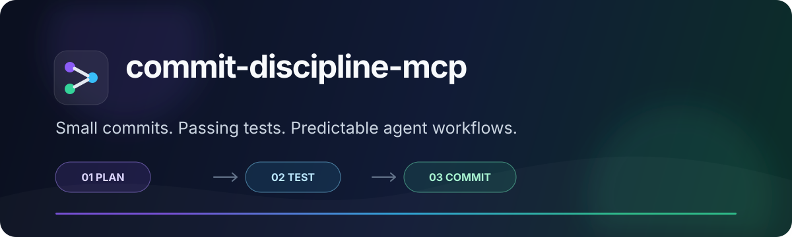
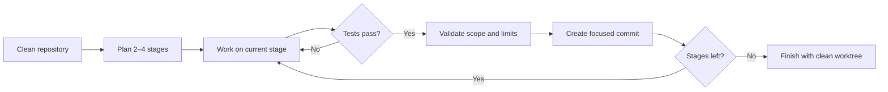

<p align="center">
  
</p>

<p align="center">
  <a href="https://www.npmjs.com/package/commit-discipline-mcp"></a>
  <a href="https://www.npmjs.com/package/commit-discipline-mcp"></a>
  <a href="https://github.com/ayush-singh-0601/commit-discipline-mcp/stargazers"></a>
  <a href="https://github.com/ayush-singh-0601/commit-discipline-mcp/actions/workflows/ci.yml"></a>
  <a href="./LICENSE"></a>
  <a href="https://nodejs.org"></a>
</p>

<p align="center"><strong>Small commits. Passing tests. Predictable agent workflows.</strong></p>

<p align="center">
  A cross-platform MCP server and CLI that turns one coding task into 2–4 ordered,<br />
  test-gated Git commits—without pushing, rewriting history, or sending telemetry.
</p>

<p align="center">
  <a href="#quick-start"><strong>Quick start</strong></a> ·
  <a href="#how-it-works"><strong>How it works</strong></a> ·
  <a href="./docs/quickstart.md"><strong>Guided demo</strong></a> ·
  <a href="#configuration"><strong>Configuration</strong></a>
</p>

---

## Why commit discipline?

Coding agents can solve large tasks quickly, but their Git history often arrives as one oversized commit—or a trail of commits made before tests ran. `commit-discipline-mcp` puts a small, deterministic control loop around that work.

| Common failure mode | Built-in guardrail |
| --- | --- |
| One giant, hard-to-review commit | Every task is planned into 2–4 ordered stages |
| Tests are run after the commit | The detected test suite must pass before staging |
| Unrelated files sneak into a commit | Files outside the active stage block the operation |
| An agent skips ahead | Only the next pending stage can be committed |
| Manual commits invalidate the plan | Unexpected `HEAD` movement is detected |
| A tool silently pushes code | This package never pushes or rewrites Git history |

It works with **Codex**, **Claude Code**, **Cursor**, and any MCP client that supports stdio tools. The same workflow is also available as a regular CLI.

## Quick start

Requirements: Node.js 18+, Git, and a clean Git repository.

```sh
npx -y commit-discipline-mcp@latest init --client all --yes
```

That command adds project-scoped MCP configuration and a reusable `commit-discipline` skill. Commit the generated files, reload your coding client, and ask:

> Use commit-discipline to split this task into small test-gated stages. Commit each completed stage and finish the task when the worktree is clean.

Choose clients explicitly when needed:

```sh
npx -y commit-discipline-mcp@latest init --client codex --yes
npx -y commit-discipline-mcp@latest init --client claude --yes
npx -y commit-discipline-mcp@latest init --client cursor --yes
```

| Client | MCP configuration | Installed skill |
| --- | --- | --- |
| Codex | `.codex/config.toml` | `.codex/skills/commit-discipline/SKILL.md` |
| Claude Code | `.mcp.json` | `.claude/skills/commit-discipline/SKILL.md` |
| Cursor | `.cursor/mcp.json` | `.cursor/skills/commit-discipline/SKILL.md` |

Use `--dry-run` to preview changes. Existing configuration is merged and backed up; `--force` is required to replace a conflicting entry.

## How it works



The MCP server exposes four focused tools:

| Tool | Purpose |
| --- | --- |
| `plan_task` | Record 2–4 stages with exact repository-relative files |
| `commit_stage` | Test, validate, stage, and commit only the active stage |
| `task_status` | Report progress and the next permitted stage |
| `finish_task` | Verify all stages are complete and the worktree is clean |

Plan state is stored locally in `.commit-discipline/plan.json` and ignored by default.

## CLI workflow

Prefer a terminal? Install the binary globally:

```sh
npm install --global commit-discipline-mcp
```

Create a stage file:

```json
[
  {
    "id": "core",
    "title": "Build the core",
    "description": "Implement the service layer",
    "files": ["src/core.ts"]
  },
  {
    "id": "tests",
    "title": "Add coverage",
    "description": "Cover the service behavior",
    "files": ["tests/core.test.ts"]
  }
]
```

Then run the lifecycle:

```sh
commit-discipline plan-task --description "Build the feature" --stages-file stages.json
commit-discipline task-status
commit-discipline commit-stage core --message "feat: add core service"
commit-discipline commit-stage tests --message "test: cover core service"
commit-discipline finish-task
```

See the [guided throwaway-repository demo](./docs/quickstart.md) for copy-pasteable PowerShell and Bash examples.

## Configuration

Add `commit-discipline.config.json` to the repository root when the defaults need adjustment:

```json
{
  "schemaVersion": 1,
  "enforcement": "strict",
  "maxFiles": 15,
  "maxLines": 400,
  "testTimeoutMs": 900000,
  "planVisibility": "local",
  "testCommand": {
    "command": "npm",
    "args": ["test"]
  }
}
```

| Option | Default | Behavior |
| --- | --- | --- |
| `enforcement` | `warn` | Use `strict` to block stages over configured limits |
| `maxFiles` | `15` | Maximum changed files per stage |
| `maxLines` | `400` | Maximum added and deleted lines per stage |
| `testTimeoutMs` | `900000` | Test-process timeout in milliseconds |
| `planVisibility` | `local` | Store plan state locally or as tracked project state |
| `testCommand` | auto-detected | Override the test command and arguments |

Without an override, the tool detects one JavaScript, Python, Go, Rust, or Make test ecosystem. If several ecosystems are present, set `testCommand` explicitly. Failed tests always block a commit.

<details>
<summary><strong>Useful CLI options</strong></summary>

- `--file <path>` commits a subset of the active stage's declared files.
- `--max-files N` and `--max-lines N` apply one-off limits.
- `--dry-run` validates a stage without tests, staging, commits, or state changes.
- `--json` returns machine-readable output for scripts and agents.

</details>

## Safety by design

- Plans start only from a clean worktree.
- Absolute paths and path traversal are rejected.
- Pre-existing staged files and out-of-scope changes are blocked.
- Tests run before staging; scope is checked again afterward.
- Dry runs do not mutate Git or plan state.
- No runtime network calls and no telemetry.
- No `git push`, force operations, resets, or history rewriting.

## Platform support

Every release is exercised across Windows, Ubuntu, and macOS on Node.js 18, 20, and 22. Packed-package smoke tests cover the full CLI lifecycle and the MCP stdio handshake.

| Platform | Native launch path | Status |
| --- | --- | --- |
| Windows | `cmd.exe` + npm shim | Tested in PowerShell and Command Prompt |
| Linux | `npx` | Tested in Bash |
| macOS | `npx` | Tested in Zsh |

For implementation details and trust boundaries, read the [architecture overview](./docs/architecture.md). Reusable starting points are available in [`examples/`](./examples/).

## Development

```sh
git clone https://github.com/ayush-singh-0601/commit-discipline-mcp.git
cd commit-discipline-mcp
npm ci
npm run verify
npm run smoke:package
npm run benchmark:git
```

The release gate includes type checking, 46+ unit and integration tests, package installation, a complete CLI/MCP lifecycle, and a Git-overhead benchmark against the PRD's 300 ms target.

## Community

- Read [CONTRIBUTING.md](./CONTRIBUTING.md) before opening a pull request.
- Report vulnerabilities privately using [SECURITY.md](./SECURITY.md).
- Get usage help through [SUPPORT.md](./SUPPORT.md).
- See [CHANGELOG.md](./CHANGELOG.md) for release history.
- Track upcoming directions in [ROADMAP.md](./ROADMAP.md).

If this project makes your agent-generated Git history easier to review, consider starring it—it helps other developers discover the tool.

## License

[MIT](./LICENSE) © Ayush Singh
