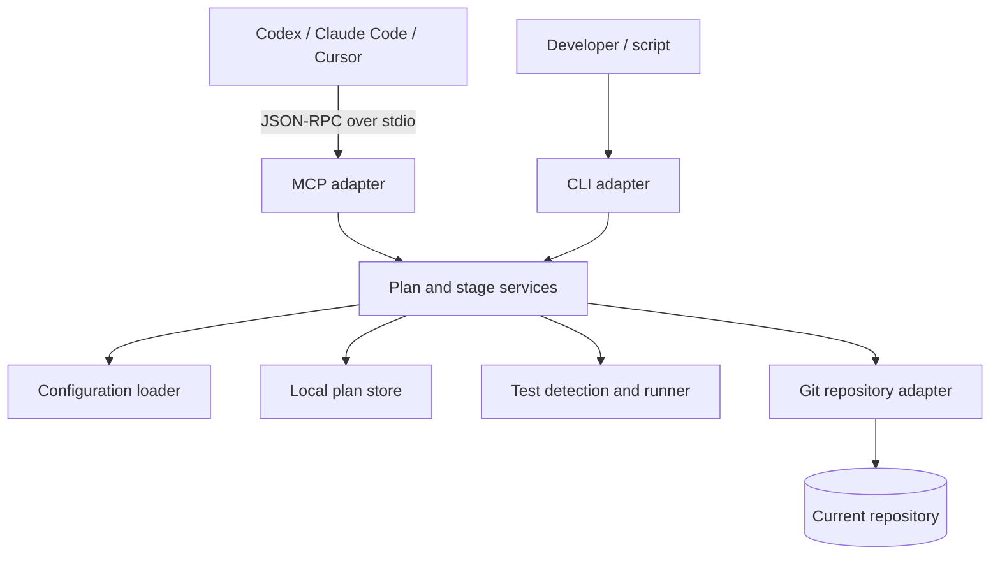

# Architecture

`commit-discipline-mcp` is intentionally small: one domain workflow is exposed through two adapters, an MCP stdio server and a command-line interface.

## Components

| Area | Responsibility |
| --- | --- |
| `src/mcp.ts` | Line-delimited JSON-RPC transport, MCP initialization, and tool dispatch |
| `src/cli.ts` | Command parsing and human/machine-readable output |
| `src/service/plan-service.ts` | Plan creation, validation, and status reporting |
| `src/service/stage-service.ts` | Test-gated stage validation and commit orchestration |
| `src/git/` | Repository inspection, diff measurement, exact-path staging, and commits |
| `src/test-runner/` | Cross-ecosystem test detection and process execution |
| `src/state/` | Atomic local plan persistence |
| `src/init/` | Project-scoped client configuration and skill installation |

## Commit transaction

For an active stage, `commit_stage` follows this order:

1. Resolve the repository and load the active plan.
2. Verify that `HEAD` still matches the plan's expected history.
3. Reject staged or modified files outside the permitted stage scope.
4. Detect and run the configured project test command.
5. Recheck scope after tests in case the test process generated files.
6. Measure the diff and enforce file/line limits.
7. Stage only the selected repository-relative paths.
8. Create the commit and atomically advance local plan state.

The state transition happens only after Git reports a successful commit.

## Trust boundaries

- MCP input is validated with Zod before it reaches services.
- Stage paths must be exact repository-relative paths; traversal and absolute paths are rejected.
- The package starts child processes only for Git and the selected test command.
- No source code, plan data, environment data, or usage metrics leave the machine.
- The package has no push, reset, rebase, or force-operation capability.

## Portability

Process invocation is centralized so Windows npm shims use the native command shell while direct executables stay shell-free. Client initialization uses the OS-native home directory and writes platform-appropriate stdio commands.

Git behavior is validated across Windows, Ubuntu, and macOS. The test runner supports npm, pnpm, Yarn, Python/pytest, Go, Cargo, and Make when their corresponding project manifests and executables are available.
